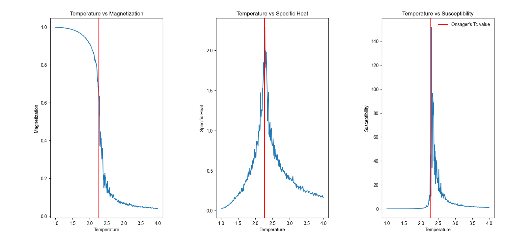
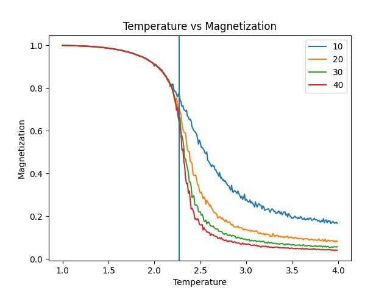

# Metropolis Monte Carlo Simulation of the 2D Ising Model

## Physics:
The Ising model is a theoretical model of a magnet. The magnetization of a magnetic material is made up of the combination of many small magnetic dipoles spread throughout the material. If these dipoles point in random directions then the overall magnetization of the system will be close to zero, but if they line up so that all or most of the dipoles points in same direction then the material has a non zero magnetic moment or the material becomes magnetized. The Ising model is a model of this process in which the individual dipole moments are represented by dipoles or "spins" arranged on a grid or lattice.

Another important feature of magnetic materials is that the individual magnetic dipoles in the material may interact magnetically in a way that is energetically favourable for them to line up in same direction. Then the actual energy of interaction is -J &sum; s<sub>i</sub>s<sub>j</sub> , which is the sum over pairs i,j that are adjacent on the lattice.

It exhibits a second-order phase transition at a precise critical temperature (Tc). Below Tc, it enters an ordered ferromagnetic phase with spontaneous magnetization and above Tc thermal fluctuations destroy the order, resulting in a disordered paramagnetic phase. 
Tc = 2.269 in units of J and Kb(Boltzman's constant).

## Methods:
I used the Metropolis algorithm in this project. Starting with an initial system we randomly choose a grid point and decide to flip the spin according to the boltzman distribution. That is, if the energy change is favourable for the system it is flipped and if not then it is flipped with the probability of e<sup>-ΔE/kT</sup>. Doing this over many steps we get a stable state for the system and measure observables like Magnetization, Specific Heat and Susceptibility.

I used checkerboard technique for making the program fast. If we randomly choose each point then it is very time consuming to compute. Hence, I flipped every alternate square (either black or white checkerboard square) as they do not affect thier adjacent squares. And using numpys array manipulation computed the energy change in one go and decided if each move is allowed.

## Results:
The results are as expected. 

- The magnetization has a drop near the critical temperature (Tc), and after that the magnetization is continuing to be near zero.

- The Specific Heat of the system has a sharp peak near the Tc point.

- Similarly, Susceptibility also has a sharp peak near the critical point.



Finite Size Scaling:

- Using finite size scaling we observe that using a larger grid gives a steeper drop near the Tc point. 



## Dependencies:
- numpy
- matplotlib

## How to Run:
Run the single system simulation:
```bash
python single_system.py
```

Run the finite size scaling simulation:
```bash
python finite_size_scaling.py
```